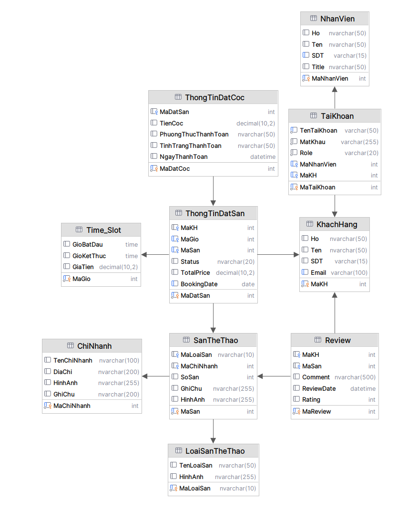

# 🗄️ Thiết Kế Database

## Hệ Thống Đặt Sân Thể Thao — Sport Facility Booking

**Database:** sport_facility_booking 
**Engine:** SQL Server / Azure SQL 
**Charset:** NVARCHAR (Unicode support) 

---

## 1. SƠ ĐỒ QUAN HỆ

```
NhanVien ─────────────┐
                      │
                      ↓
                  TaiKhoan
                      ↑
                      │
KhachHang ────────────┘

ChiNhanh ──→ SanTheThao ←── LoaiSanTheThao
                    │
                    ↓
              ThongTinDatSan ───→ ThongTinDatCoc
                    │
                    ↓
                 Review

Time_Slot ─────────→ ThongTinDatSan
```

---

## 📸 2. ERD Diagram




## 3. CHI TIẾT TỪNG BẢNG

---

### 3.1 KhachHang

Lưu thông tin khách hàng.

| Cột   | Kiểu         | Ràng buộc    | Mô tả    |
| ----- | ------------ | ------------ | -------- |
| MaKH  | INT          | PK, IDENTITY | Mã khách |
| Ho    | NVARCHAR(50) |              | Họ       |
| Ten   | NVARCHAR(50) |              | Tên      |
| SDT   | VARCHAR(15)  |              | SĐT      |
| Email | VARCHAR(100) | UNIQUE       | Email    |

```sql
CREATE TABLE KhachHang (
    MaKH INT PRIMARY KEY IDENTITY(1,1),
    Ho NVARCHAR(50),
    Ten NVARCHAR(50),
    SDT VARCHAR(15),
    Email VARCHAR(100) UNIQUE
);
```

---

### 3.2 NhanVien

Thông tin nhân viên hệ thống.

| Cột        | Kiểu         | Ràng buộc | Mô tả        |
| ---------- | ------------ | --------- | ------------ |
| MaNhanVien | INT          | PK        | Mã nhân viên |
| Ho         | NVARCHAR(50) |           | Họ           |
| Ten        | NVARCHAR(50) |           | Tên          |
| SDT        | VARCHAR(15)  | UNIQUE    | SĐT          |
| Title      | NVARCHAR(50) |           | Chức vụ      |

```sql
CREATE TABLE NhanVien (
    MaNhanVien INT PRIMARY KEY IDENTITY(1,1),
    Ho NVARCHAR(50),
    Ten NVARCHAR(50),
    SDT VARCHAR(15) UNIQUE,
    Title NVARCHAR(50)
);
```

---

### 3.3 TaiKhoan

Quản lý đăng nhập hệ thống.

| Cột         | Kiểu         | Ràng buộc | Mô tả                    |
| ----------- | ------------ | --------- | ------------------------ |
| MaTaiKhoan  | INT          | PK        | ID tài khoản             |
| TenTaiKhoan | VARCHAR(50)  | UNIQUE    | Username                 |
| MatKhau     | VARCHAR(255) |           | Password                 |
| Role        | VARCHAR(20)  | CHECK     | Admin / Staff / Customer |
| MaNhanVien  | INT          | FK        | Nhân viên                |
| MaKH        | INT          | FK        | Khách                    |

Quy tắc:

* Chỉ được chọn **1 trong 2: MaNhanVien hoặc MaKH**

```sql
CREATE TABLE TaiKhoan (
    MaTaiKhoan INT PRIMARY KEY IDENTITY (1,1),
    TenTaiKhoan VARCHAR(50) UNIQUE NOT NULL,
    MatKhau VARCHAR(255) NOT NULL,
    Role VARCHAR(20) NOT NULL
        CHECK (Role IN ('Admin','Staff','Customer')),
    MaNhanVien INT NULL,
    MaKH INT NULL,
    FOREIGN KEY (MaNhanVien) REFERENCES NhanVien(MaNhanVien),
    FOREIGN KEY (MaKH) REFERENCES KhachHang(MaKH)
);
```

---

### 3.4 ChiNhanh

Thông tin chi nhánh.

| Cột         | Kiểu         | Ràng buộc | Mô tả                    |
| ----------- | ------------ | --------- | ------------------------ |
| MaChiNhanh  | INT          | PK        | ID Chi nhánh             |
| TenChiNhanh | NVARCHAR(100)|           | Tên chi nhánh            |
| DiaChi      | NVARCHAR(200)|           | Địa chỉ                  |
| HinhAnh     | NVARCHAR(255)|           | URL hình ảnh minh họa    |
| GhiChu      | NVARCHAR(200)|           | Ghi chú                  |

```sql
CREATE TABLE ChiNhanh (
    MaChiNhanh INT PRIMARY KEY IDENTITY(1,1),
    TenChiNhanh NVARCHAR(100),
    DiaChi NVARCHAR(200),
    HinhAnh NVARCHAR(255),
    GhiChu NVARCHAR(200)
);
```

---

### 3.5 LoaiSanTheThao

Danh mục loại sân.

| Cột         | Kiểu         | Ràng buộc | Mô tả                    |
| ----------- | ------------ | --------- | ------------------------ |
| MaLoaiSan   | NVARCHAR(10) | PK        | ID Loại sân              |
| TenLoaiSan  | NVARCHAR(50) |           | Tên loại sân             |
| HinhAnh     | NVARCHAR(255)|           | URL hình ảnh minh họa    |

```sql
CREATE TABLE LoaiSanTheThao (
    MaLoaiSan NVARCHAR(10) PRIMARY KEY,
    TenLoaiSan NVARCHAR(50),
    HinhAnh NVARCHAR(255)
);
```

---

### 3.6 SanTheThao

Thông tin sân.

| Cột        | Kiểu          | Ràng buộc           | Mô tả                             |
| ---------- | ------------- | ------------------- | --------------------------------- |
| MaSan      | INT           | PK                  | Mã sân                            |
| MaLoaiSan  | NVARCHAR(10)  | FK                  | Loại sân (cầu lông, pickleball,…) |
| MaChiNhanh | INT           | FK                  | Thuộc chi nhánh nào               |
| SoSan      | INT           | NOT NULL            | Số thứ tự sân trong chi nhánh     |
| GhiChu     | NVARCHAR(255) |                     | Thông tin thêm                    |
| HinhAnh    | NVARCHAR(255) |                     | Hình ảnh sân                      |


```sql
CREATE TABLE SanTheThao (
    MaSan INT PRIMARY KEY IDENTITY(1,1),
    MaLoaiSan NVARCHAR(10),
    MaChiNhanh INT,
    SoSan INT,
    GhiChu NVARCHAR(255),
    HinhAnh NVARCHAR(255),
    FOREIGN KEY (MaLoaiSan) REFERENCES LoaiSanTheThao(MaLoaiSan),
    FOREIGN KEY (MaChiNhanh) REFERENCES ChiNhanh(MaChiNhanh)
);
```

---

### 3.7 Time_Slot

Khung giờ đặt sân.

| Cột        | Kiểu          | Ràng buộc    | Mô tả                  |
| ---------- | ------------- | ------------ | ---------------------- |
| MaGio      | INT           | PK           | Mã khung giờ           |
| GioBatDau  | TIME          | NOT NULL     | Giờ bắt đầu            |
| GioKetThuc | TIME          | NOT NULL     | Giờ kết thúc           |
| GiaTien    | DECIMAL(10,2) | NOT NULL     | Giá tiền cho khung giờ |


```sql
CREATE TABLE Time_Slot (
    MaGio INT PRIMARY KEY IDENTITY(1,1),
    GioBatDau TIME,
    GioKetThuc TIME,
    GiaTien DECIMAL(10,2)
);
```

---

### 3.8 ThongTinDatSan

Thông tin đặt sân.

| Cột         | Kiểu          | Ràng buộc       | Mô tả                             |
| ----------- | ------------- | --------------- | --------------------------------- |
| MaDatSan    | INT           | PK              | Mã đặt sân                        |
| MaKH        | INT           | FK              | Khách hàng đặt                    |
| MaGio       | INT           | FK              | Khung giờ                         |
| MaSan       | INT           | FK              | Sân được đặt                      |
| BookingDate | DATE          | NOT NULL        | Ngày đặt                          |
| Status      | NVARCHAR(20)  | CHECK           | Trạng thái (Pending, Confirmed,…) |
| TotalPrice  | DECIMAL(10,2) |                 | Tổng tiền                         |

UNIQUE (MaSan, MaGio, BookingDate)
→ Không cho phép đặt trùng lịch

```sql
CREATE TABLE ThongTinDatSan (
    MaDatSan INT PRIMARY KEY IDENTITY(1,1),
    MaKH INT,
    MaGio INT,
    MaSan INT,
    Status NVARCHAR(20) DEFAULT 'Pending',
    TotalPrice DECIMAL(10,2),
    BookingDate DATE,

    CHECK (Status IN ('Pending','Confirmed','Cancelled','Completed')),

    FOREIGN KEY (MaKH) REFERENCES KhachHang(MaKH),
    FOREIGN KEY (MaGio) REFERENCES Time_Slot(MaGio),
    FOREIGN KEY (MaSan) REFERENCES SanTheThao(MaSan),

    UNIQUE (MaSan, MaGio, BookingDate)
);
```

---

### 3.9 ThongTinDatCoc

Thanh toán tiền cọc.

| Cột                 | Kiểu          | Ràng buộc           | Mô tả                      |
| ------------------- | ------------- | ------------------- | -------------------------- |
| MaDatCoc            | INT           | PK                  | Mã đặt cọc                 |
| MaDatSan            | INT           | FK                  | Booking liên quan          |
| TienCoc             | DECIMAL(10,2) | NOT NULL            | Số tiền cọc                |
| PhuongThucThanhToan | NVARCHAR(50)  |                     | Phương thức (Momo, Cash,…) |
| TinhTrangThanhToan  | NVARCHAR(50)  |                     | Trạng thái (Paid, Pending) |
| NgayThanhToan       | DATETIME      |                     | Thời gian thanh toán       |


```sql
CREATE TABLE ThongTinDatCoc (
    MaDatCoc INT PRIMARY KEY IDENTITY(1,1),
    MaDatSan INT,
    TienCoc DECIMAL(10,2),
    PhuongThucThanhToan NVARCHAR(50),
    TinhTrangThanhToan NVARCHAR(50),
    NgayThanhToan DATETIME,
    FOREIGN KEY (MaDatSan) REFERENCES ThongTinDatSan(MaDatSan)
);
```

---

### 3.10 Review

Đánh giá sân.

| Cột        | Kiểu          | Ràng buộc       | Mô tả             |
| ---------- | ------------- | --------------- | ----------------- |
| MaReview   | INT           | PK              | Mã đánh giá       |
| MaKH       | INT           | FK              | Người đánh giá    |
| MaSan      | INT           | FK              | Sân được đánh giá |
| Comment    | NVARCHAR(500) |                 | Nội dung nhận xét |
| Rating     | INT           | CHECK (1–5)     | Điểm đánh giá     |
| ReviewDate | DATETIME      |                 | Ngày đánh giá     |


```sql
CREATE TABLE Review (
    MaReview INT PRIMARY KEY IDENTITY(1,1),
    MaKH INT,
    MaSan INT,
    Comment NVARCHAR(500),
    ReviewDate DATETIME,
    Rating INT CHECK (Rating BETWEEN 1 AND 5),
    FOREIGN KEY (MaKH) REFERENCES KhachHang(MaKH),
    FOREIGN KEY (MaSan) REFERENCES SanTheThao(MaSan)
);
```

---

## 4. QUY TẮC NGHIỆP VỤ

* Một tài khoản chỉ thuộc **1 loại user**
* Không được đặt trùng:

  * Sân + Khung giờ + Ngày
* Customer có thể:

  * đăng ký account
  * hoặc chỉ tồn tại như guest
* Chỉ Admin/Staff có quyền quản lý hệ thống

---

## 5. DỮ LIỆU TEST

* Admin: admin / 123456
* Staff: staff1 / 123456
* Customer: vana / 123456

---

## 6. KẾT LUẬN

Database đảm bảo:

* Tính toàn vẹn dữ liệu
* Dễ mở rộng
* Phù hợp triển khai thực tế (mức cơ bản)

---
